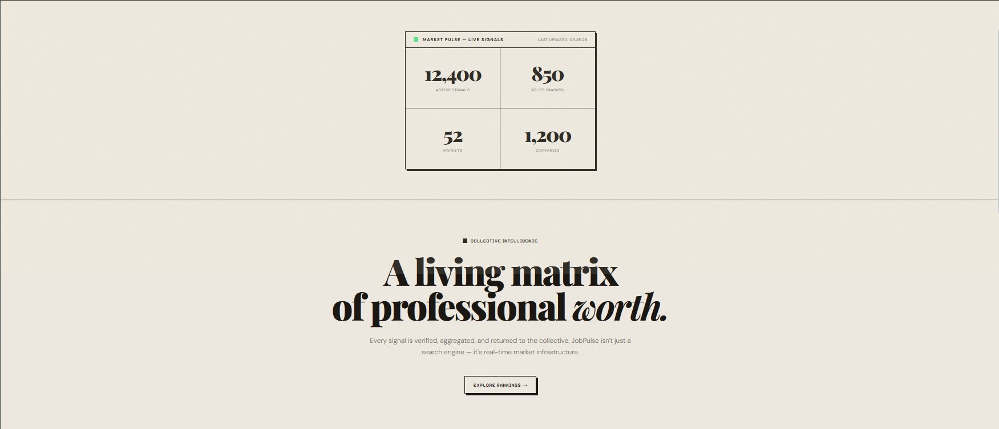
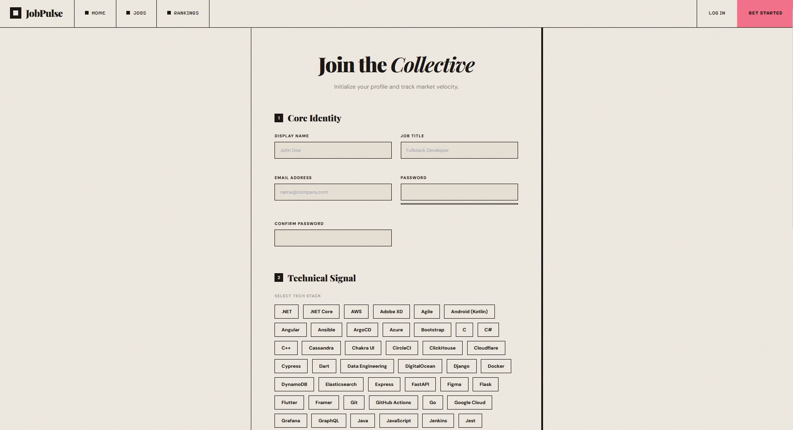
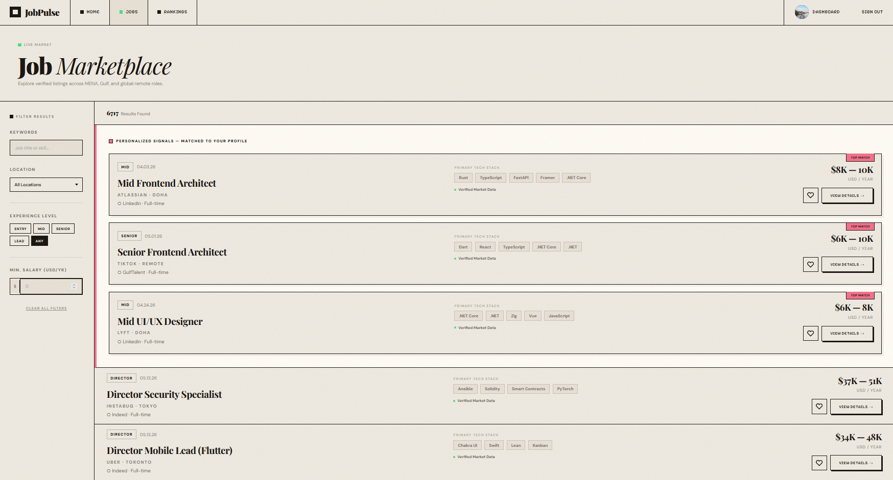
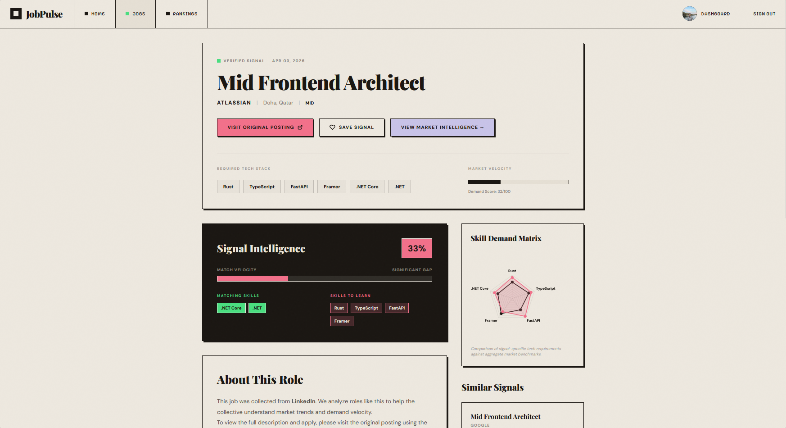
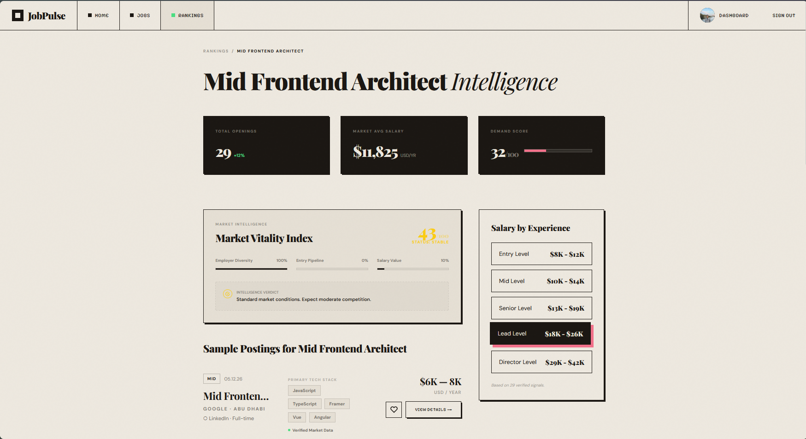
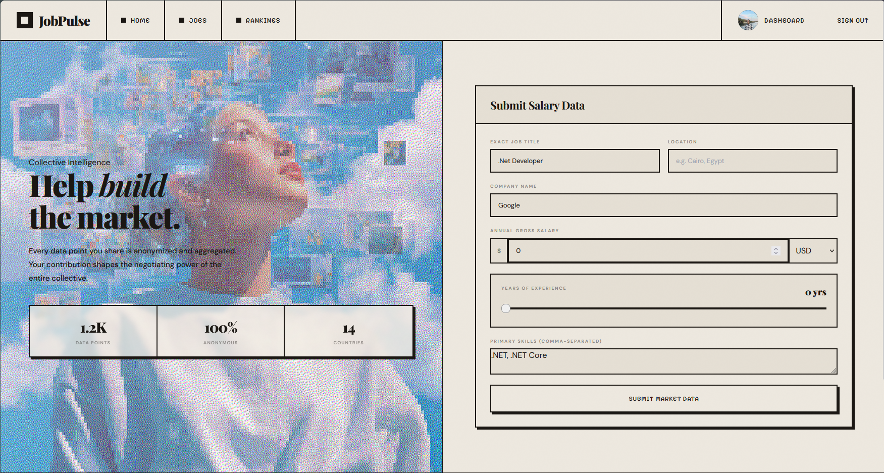

# 💼 Jobalatica - Your Smart Job Salary Marketplace

> **Empowering Job Seekers with Real Salary Data** 📊  
> A modern platform to explore jobs, compare salaries, and make informed career decisions.

[](LICENSE)
[](.)
[](.)
[](.)
[](.)
[](https://github.com/Hazem-Ayman/Jobalatica)

---

## 🎯 About Jobalatica

Jobalatica is a revolutionary job marketplace designed to bring **transparency to salary information**. Whether you're actively job hunting or curious about industry standards, Jobalatica provides real data from real professionals to help you:

✅ **Discover career opportunities** across multiple industries  
✅ **Compare salary ranges** transparently  
✅ **Submit your own salary data** to contribute to the community  
✅ **Make informed career decisions** backed by real data  

---

## ⭐ Key Features

<table>
<tr>
<td width="33%">
  <h3>🔍 Smart Job Search</h3>
  <p>Browse and filter job listings with ease. Find opportunities that match your skills and aspirations.</p>
</td>
<td width="33%">
  <h3>💰 Transparent Salaries</h3>
  <p>Real salary data from real professionals. Compare compensation across roles and companies.</p>
</td>
<td width="33%">
  <h3>👥 Community-Driven</h3>
  <p>Submit your salary data anonymously and help others make better career choices.</p>
</td>
</tr>
</table>

---

## 📸 Platform Showcase

### 🏠 Landing Page - First Impressions Matter

Your first encounter with Jobalatica sets the tone. The landing page welcomes you with a clean, intuitive design that immediately communicates the platform's core mission: helping professionals find better opportunities with transparent salary information.


**Key Highlights:**
- 🎨 Sleek, modern interface
- 🔎 Prominent search bar for quick job discovery
- ⚡ Featured opportunities showcase
- 📊 Market insights at a glance

---

### 🚀 Discover More Features - Extended Homepage

As you scroll further, you'll find comprehensive information about what makes Jobalatica unique. This section highlights our community-driven approach and demonstrates how professionals like you are leveraging our platform to make better career decisions.



**Discover:**
- 🌍 Global industry coverage and opportunities
- 💡 Real success stories from our community
- 🤝 Collaborative features that connect professionals
- 🚀 Step-by-step onboarding for new members

---

### 👤 Join the Community - Registration Made Simple

Ready to get started? Our streamlined registration process gets you up and running in minutes. Secure your account, customize your profile, and begin your journey toward better career decisions.



**Setup Process Includes:**
- ✏️ Simple account creation
- 🔐 Bank-level security
- 👥 Professional profile setup
- ⚙️ Personalized privacy controls

---

### 💼 Explore Opportunities - Your Job Search Starts Here

Browse our extensive job marketplace with powerful filtering capabilities. Find positions across industries, experience levels, and locations. Each listing is enriched with real salary data submitted by professionals in those roles.



**Search & Filter By:**
- 🔍 Job title, company, or industry
- 📍 Geographic location and remote options
- 💰 Salary range expectations
- 📋 Experience level requirements
- 🏷️ Skills and specializations

---

### 🎯 Detailed Job Insights - Salary Transparency in Action

Click on any job to uncover detailed information including actual salary ranges, compensation packages, and company insights. This transparent approach empowers you to negotiate confidently and make informed career moves.



**Information Provided:**
- 💰 Salary range with historical trends
- 📈 Compensation benchmarks
- 📋 Complete job description
- 🏢 Verified company details
- 🌐 Work location and flexibility
- 🎓 Required qualifications
- 💼 Direct application option

---

### 📊 Compare & Decide - Data-Driven Career Choices

Every job listing provides comprehensive comparison tools. Stack opportunities side-by-side, analyze salary progression, and understand how different roles compare within your industry. Make your career decisions with confidence backed by real data.



**Comparison Features:**
- 📊 Visual salary analysis
- 🔄 Similar role comparisons
- 📈 Industry benchmarking data
- 🧠 Career path recommendations
- ⭐ Peer reviews and ratings
- 💬 Community feedback

---

### 💡 Share Your Story - Give Back to the Community

Help others make informed decisions by sharing your salary experience. Our anonymous submission process ensures your privacy while building a comprehensive database that benefits the entire community. Every submission strengthens our collective knowledge.



**Anonymous Contribution:**
- 📝 Quick, easy-to-complete form
- 💰 Detailed compensation tracking
- 🎁 Benefits and perks documentation
- 🏢 Company and role information
- 🔒 Strict privacy protection
- ✔️ Data integrity verification

---

## 🚀 Getting Started

### Prerequisites
- **.NET Framework** (for C# backend)
- **Modern Web Browser** (Chrome, Firefox, Edge, Safari)
- **Node.js** (optional, for frontend tools)
- **Git**

### Installation

```bash
# Clone the repository
git clone https://github.com/Hazem-Ayman/Jobalatica.git
cd Jobalatica

# Switch to the main development branch
git checkout "hazem full 1st try"

# Install dependencies (for .NET)
dotnet restore

# Build the project
dotnet build

# Run the application
dotnet run
```

Visit `http://localhost:5000` in your browser to explore Jobalatica!

---

## 💻 Tech Stack

| Frontend | Backend | Database | Tools |
|----------|---------|----------|-------|
| 🎨 HTML5 | 🔷 C# | 📊 SQL Server | 🔧 Git |
| 🎭 CSS3 | 🌐 ASP.NET Core | 💾 Entity Framework | 📦 NuGet |
| ✨ JavaScript | ⚡ RESTful APIs | 🔐 Authentication | 🐛 Debugging |

---

## 📁 Project Structure

```
Jobalatica/
├── docs/
│   └── images/
│       ├── 01-home-page-1.png
│       ├── 02-home-page-2.png
│       ├── 03-signup-page.png
│       ├── 04-jobs-page.png
│       ├── 05-specific-job-1.png
│       ├── 06-specific-job-2.png
│       └── 07-salary-submit-page.png
├── src/
│   ├── Frontend/
│   ├── Backend/
│   └── Database/
├── .gitignore
├── README.md
└── LICENSE
```

---

## 🎨 Features Overview

### 🔐 User Authentication
- Secure login & registration
- Email verification
- Password recovery
- Profile management

### 💼 Job Management
- Post new job listings
- Manage applications
- Track job status
- Company profiles

### 💰 Salary Transparency
- Real salary submissions
- Salary trend analysis
- Industry benchmarks
- Anonymous data sharing

### 📊 Analytics & Insights
- Market trends
- Salary statistics
- Industry reports
- Career path recommendations

---

## 🤝 Contributing

We believe in the power of community collaboration! Here's how you can contribute:

1. **Report Issues** - Found a bug? [Open an issue](https://github.com/Hazem-Ayman/Jobalatica/issues)
2. **Share Salary Data** - Help build our database by submitting salary information
3. **Code Contributions** - Fork, create a feature branch, and submit a pull request
4. **Improve Documentation** - Help us document features and workflows
5. **Suggest Features** - Have an idea? Start a discussion!

### Contributing Steps

```bash
# 1. Fork the repository
# 2. Create your feature branch
git checkout -b feature/YourFeature

# 3. Commit your changes
git commit -m "Add YourFeature: Description"

# 4. Push to the branch
git push origin feature/YourFeature

# 5. Open a Pull Request
```

---

## 📋 Development Branches

- **main** - Production-ready code
- **hazem full 1st try** - Main development branch (feature implementations)
- **feature/** - Feature branches for new functionality
- **bugfix/** - Bug fix branches

---

## 🐛 Known Issues & Roadmap

### Current Version
- ✅ Job search and filtering
- ✅ Salary submission
- ✅ User authentication
- ✅ Job detail pages

### Upcoming Features
- 🔄 Advanced salary comparison tools
- 🔄 Mobile app version
- 🔄 AI-powered job recommendations
- 🔄 Salary negotiation guides
- 🔄 Interview preparation resources

---

## 📝 License

This project is licensed under the MIT License - see the [LICENSE](LICENSE) file for details.

---

## 🙏 Acknowledgments

- 🎯 Built with passion for job seekers everywhere
- 💼 Dedicated to bringing transparency to salary information
- 🌍 Created to help professionals make better career decisions
- 👥 Powered by community contributions

---

## 📞 Support & Contact

- 🐙 **GitHub:** [@Hazem-Ayman](https://github.com/Hazem-Ayman)
- 💬 **Issues:** [Report bugs or request features](https://github.com/Hazem-Ayman/Jobalatica/issues)
- 📧 **Email:** Check GitHub profile for contact information
- 🌟 **Star us** if you believe in transparent salary information!

---

## 🔐 Privacy & Data Security

At Jobalatica, we take your privacy seriously:

- ✅ Anonymous salary submissions
- ✅ Encrypted data storage
- ✅ No personal information sharing
- ✅ GDPR compliant
- ✅ Transparent data policies

---

<div align="center">

### 💼 Ready to explore your career potential?

**[Sign Up Now](https://github.com/Hazem-Ayman/Jobalatica)** | **[Browse Jobs](#)** | **[Submit Salary Data](#)**

*Empowering professionals with real salary data.* 💰

**⭐ Star this repository if you believe in salary transparency!**

[⬆ Back to top](#-jobalatica---your-smart-job-salary-marketplace)

</div>
