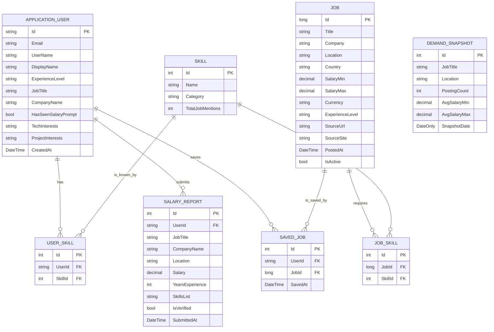

# Jobalatica Database Schema

This document provides a comprehensive overview of the database schema for the Jobalatica project, based on the Entity Framework Core models found in the `Jobalatica.Models.Entities` namespace.

## Schema Diagram (Conceptual)

## Table Definitions

### 1. AspNetUsers (ApplicationUser)
Extends the default ASP.NET Core Identity user with profile-specific fields.

| Column | Type | Description |
| :--- | :--- | :--- |
| `Id` | `string` (PK) | Unique identifier (GUID). |
| `DisplayName` | `string` | User's preferred name. |
| `ExperienceLevel` | `string` | Junior, Mid, Senior, etc. |
| `JobTitle` | `string` | Current job title. |
| `CompanyName` | `string` | Current employer. |
| `HasSeenSalaryPrompt` | `bool` | Whether the user has been prompted for salary data. |
| `TechInterests` | `string` | Technologies the user is interested in. |
| `ProjectInterests` | `string` | Types of projects the user is interested in. |
| `CreatedAt` | `DateTime` | Account creation timestamp. |
| `LastLoginAt` | `DateTime?` | Last recorded login time. |

### 2. Jobs
Stores job postings scraped from various sources.

| Column | Type | Description |
| :--- | :--- | :--- |
| `Id` | `long` (PK) | Unique identifier. |
| `Title` | `string` | Job title. |
| `Company` | `string` | Hiring company. |
| `Location` | `string` | City/Region. |
| `Country` | `string` | Country name. |
| `SalaryMin` | `decimal?` | Minimum salary offered (Precision: 10, 2). |
| `SalaryMax` | `decimal?` | Maximum salary offered (Precision: 10, 2). |
| `Currency` | `string` | Default: "USD". |
| `ExperienceLevel` | `string` | Level required for the job. |
| `SourceUrl` | `string` | Link to the original posting. |
| `SourceSite` | `string` | Name of the source platform. |
| `PostedAt` | `DateTime` | When the job was posted. |
| `ScrapedAt` | `DateTime` | When the data was imported. |
| `IsActive` | `bool` | Whether the job is still available. |

### 3. Skills
Master list of technical and soft skills.

| Column | Type | Description |
| :--- | :--- | :--- |
| `Id` | `int` (PK) | Unique identifier. |
| `Name` | `string` | Name of the skill (e.g., "C#", "React"). |
| `Category` | `string` | Grouping (e.g., "Language", "Framework"). |
| `TotalJobMentions` | `int` | Global count of jobs requiring this skill. |

### 4. JobSkills
Join table for the many-to-many relationship between **Jobs** and **Skills**.

| Column | Type | Description |
| :--- | :--- | :--- |
| `Id` | `int` (PK) | Unique identifier. |
| `JobId` | `long` (FK) | Reference to `Jobs.Id`. |
| `SkillId` | `int` (FK) | Reference to `Skills.Id`. |

### 5. UserSkills
Join table for the many-to-many relationship between **Users** and **Skills**.

| Column | Type | Description |
| :--- | :--- | :--- |
| `Id` | `int` (PK) | Unique identifier. |
| `UserId` | `string` (FK) | Reference to `AspNetUsers.Id`. |
| `SkillId` | `int` (FK) | Reference to `Skills.Id`. |

*Note: There is a unique index on (`UserId`, `SkillId`) to prevent duplicate entries.*

### 6. SavedJobs
Stores jobs that users have bookmarked.

| Column | Type | Description |
| :--- | :--- | :--- |
| `Id` | `int` (PK) | Unique identifier. |
| `UserId` | `string` (FK) | Reference to `AspNetUsers.Id`. |
| `JobId` | `long` (FK) | Reference to `Jobs.Id`. |
| `SavedAt` | `DateTime` | Timestamp of when it was saved. |

*Note: There is a unique index on (`UserId`, `JobId`) to prevent duplicate saves.*

### 7. SalaryReports
User-submitted salary data for community insights.

| Column | Type | Description |
| :--- | :--- | :--- |
| `Id` | `int` (PK) | Unique identifier. |
| `UserId` | `string?` (FK) | Reference to `AspNetUsers.Id` (Optional). |
| `JobTitle` | `string` | Role title for the report. |
| `CompanyName` | `string` | Company associated with the salary. |
| `Location` | `string` | Geographical location. |
| `Salary` | `decimal` | Annual/Monthly salary (Precision: 10, 2). |
| `Currency` | `string` | Currency of the reported salary. |
| `YearsExperience` | `int` | Total years of experience. |
| `SkillsList` | `string` | Comma-separated list of relevant skills. |
| `IsVerified` | `bool` | Whether the report has been validated. |
| `SubmittedAt` | `DateTime` | Submission timestamp. |

### 8. DemandSnapshots
Aggregated data snapshots for trend analysis and visualizations.

| Column | Type | Description |
| :--- | :--- | :--- |
| `Id` | `int` (PK) | Unique identifier. |
| `JobTitle` | `string` | Aggregated role title. |
| `Location` | `string` | Aggregated location. |
| `PostingCount` | `int` | Number of jobs found in this category. |
| `AvgSalaryMin` | `decimal` | Calculated average minimum (Precision: 10, 2). |
| `AvgSalaryMax` | `decimal` | Calculated average maximum (Precision: 10, 2). |
| `SnapshotDate` | `DateOnly` | The date this aggregation was performed. |

---

> [!NOTE]
> The database uses SQLite as evidenced by `JobPulse.db` in the root directory. Decimal values are handled with a precision of (10, 2) as configured in `ApplicationDbContext.OnModelCreating`.
